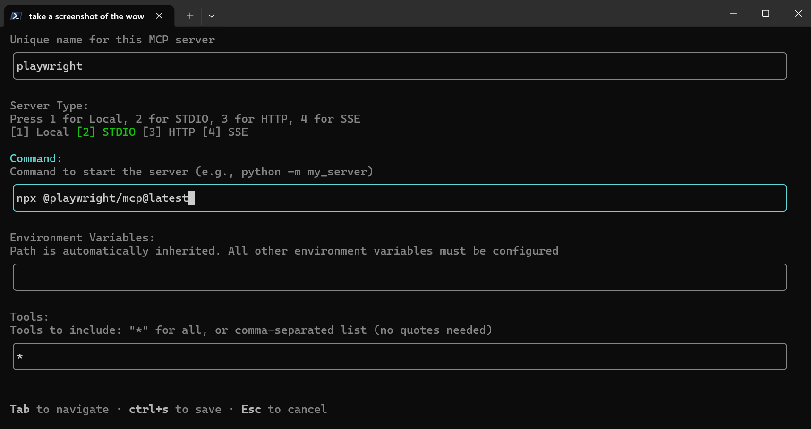

# Playwright MCP

## What Is It?

Playwright MCP gives Copilot the ability to control a browser — navigating pages, clicking elements, filling forms, and taking screenshots. It bridges the gap between "code that runs" and "outcomes you can see."

## Why I Recommend It

I consider Playwright MCP an **always-on** tool for two distinct reasons:

### 1. Testing assistance

Playwright is already a leading browser automation and testing framework. With the MCP server, Copilot can:
- Generate Playwright test code with awareness of your actual page structure
- Run tests and interpret results
- Debug failing tests by seeing what the browser actually shows

### 2. Visual verification (the killer feature)

This is the reason Playwright MCP is in my always-on category. When Copilot can **see** the result of its changes:

- **CSS and layout work** — Copilot can take a screenshot, see that a flexbox isn't centering correctly, and iterate on the fix without you describing what's wrong
- **UI component development** — verify that a component renders as expected after changes
- **Regression detection** — compare before/after screenshots to confirm nothing broke visually

Without visual verification, Copilot is coding blind for any visually-measurable outcome. With it, you get a feedback loop that dramatically improves first-attempt quality for frontend work.

## Prerequisites

- **Node.js**: latest 20.x, 22.x, or 24.x
- **npm** (comes with Node.js)
- **Playwright installed with browsers** — see [Install Playwright](install-playwright.md) for the full walkthrough

> ⚠️ Complete the [Playwright installation prerequisite](install-playwright.md) first. The MCP server requires Playwright's browser binaries to be present.

## Installation & Configuration

The package is [`@playwright/mcp`](https://github.com/microsoft/playwright-mcp) — the official MCP server from the Playwright team at Microsoft.

### VS Code

<details>
<summary>VS Code configuration options</summary>

Add to your workspace `.vscode/mcp.json`:

```json
{
  "servers": {
    "playwright": {
      "command": "npx",
      "args": ["@playwright/mcp@latest"]
    }
  }
}
```

Or add to your VS Code User Settings (JSON) for global availability:

```json
{
  "mcp": {
    "servers": {
      "playwright": {
        "command": "npx",
        "args": ["@playwright/mcp@latest"]
      }
    }
  }
}
```

You can also install via the VS Code CLI:

```bash
code --add-mcp '{"name":"playwright","command":"npx","args":["@playwright/mcp@latest"]}'
```

</details>

### Copilot CLI

<details>
<summary>Copilot CLI configuration options</summary>

Use the interactive command within a Copilot CLI session:

```
/mcp add
```



Or create/edit the configuration file at `~/.copilot/mcp-config.json`:

```json
{
  "mcpServers": {
    "playwright": {
      "type": "local",
      "command": "npx",
      "tools": ["*"],
      "args": ["@playwright/mcp@latest"]
    }
  }
}
```

For workspace-specific setup, create `.copilot/mcp-config.json` in your project root with the same content.

</details>

### Key Configuration Options

The default no-args configuration is appropriate for most scenarios. The MCP server handles accessibility snapshots and browser interaction without needing extra flags.

Options worth considering for specific workflows:

| Option | Description |
|--------|-------------|
| `--headless` | Run headless (default is headed — you'll see the browser window) |
| `--isolated` | Don't persist browser profile between sessions (clean slate each time) |
| `--output-dir` | Directory for output files, e.g., `"playwright-output"` |
| `--browser` | Browser to use: `chrome`, `firefox`, `webkit`, `msedge` |
| `--viewport-size` | Set viewport, e.g., `"1280x720"` |
| `--device` | Emulate a device, e.g., `"iPhone 15"` |

Example with options:

```json
{
  "servers": {
    "playwright": {
      "command": "npx",
      "args": ["@playwright/mcp@latest", "--headless", "--isolated", "--output-dir", "playwright-output"]
    }
  }
}
```

> **Note on `--caps vision`**: This enables coordinate-based mouse navigation (pixel positions), not the standard screenshot/accessibility features. You don't need it for typical visual verification workflows — those work out of the box.

### Notes

- The `npx` command auto-downloads the package on first use — no global install needed
- Playwright browsers must already be installed (see [prerequisites](install-playwright.md))
- If behind a corporate proxy, set `HTTPS_PROXY` before first run
- A persistent browser profile is stored per-workspace; use `--isolated` if you want a clean slate each session

## Verification

After configuration, verify the setup is working:

### Step 1: Confirm MCP server starts

In VS Code, open the Output panel and select the MCP channel. You should see Playwright MCP initialize without errors.

In Copilot CLI, start a session and ask:
```
What MCP tools do you have available?
```
You should see Playwright-related tools listed (e.g., `browser_navigate`, `browser_snapshot`, `browser_click`, `browser_screenshot`).

### Step 2: Test a screenshot

Ask Copilot to take a screenshot of a known URL:
```
Navigate to https://github.com and take a screenshot
```

If you see a screenshot result (or Copilot describes what it sees on the page), the setup is confirmed working.

### Step 3: Test with a local app

If you have a local dev server running (e.g., `localhost:3000`):
```
Take a screenshot of http://localhost:3000
```

This confirms Playwright can reach local services — critical for the development workflow.

## Workshop: Visual Verification in Action

### Scenario: Fix a CSS Layout Bug

You have a web page where a centered hero section isn't actually centering on mobile viewports. Let's walk through how Playwright MCP transforms this workflow.

### Prerequisites for this workshop
- A running local web app (any framework — React, Next.js, plain HTML, etc.)
- Playwright MCP configured and verified (steps above)
- A CSS layout issue to fix (or introduce one intentionally for learning)

---

### Step 1: Describe the problem to Copilot

```
The hero section on my homepage should be centered vertically and horizontally,
but on mobile viewport widths it's shifted to the left. Can you take a screenshot
of http://localhost:3000 at a 375px viewport width so we can see the issue?
```

**Expected outcome:** Copilot uses Playwright to navigate to your app, sets the viewport to 375px wide, and captures a screenshot. You (and Copilot) can now see the misalignment.

### Step 2: Let Copilot analyze and fix

```
Based on what you see in that screenshot, can you identify why the hero section
isn't centered and propose a CSS fix?
```

**Expected outcome:** Copilot examines the screenshot, cross-references your CSS code, and identifies the issue (e.g., missing `margin: 0 auto`, incorrect flex properties, or a fixed-width element overflowing).

### Step 3: Apply the fix and verify

```
Apply that fix and take another screenshot at the same viewport width so we can
confirm it's resolved.
```

**Expected outcome:** Copilot edits the CSS, takes a new screenshot, and you can visually confirm the hero section is now centered.

### Step 4: Check for regressions

```
Now take a screenshot at 1440px width to make sure the desktop layout still
looks correct.
```

**Expected outcome:** Copilot screenshots the desktop viewport, confirming the mobile fix didn't break the desktop layout.

---

### The "Aha" Moment

Notice what just happened:
1. **No manual browser switching** — you stayed in your editor/terminal the entire time
2. **Copilot saw the problem itself** — you didn't have to describe pixel-level details
3. **Instant feedback loop** — fix → screenshot → confirm, all in one conversation
4. **Regression check built in** — testing multiple viewports took seconds, not minutes

This workflow is impossible without Playwright MCP. With it, CSS and visual work becomes a collaborative conversation instead of a back-and-forth of "try this, no that's not right, try again."

## Troubleshooting

| Symptom | Likely cause | Fix |
|---------|-------------|-----|
| MCP server won't start | Node.js not in PATH | Ensure `node --version` works in your terminal |
| "Browser not found" | Playwright browsers not installed | Run `npx playwright install chromium` (see [prerequisites](install-playwright.md)) |
| Can't reach localhost | Server not running or wrong port | Verify your dev server is up on the expected port |
| Screenshots are blank | Page hasn't loaded yet | The MCP tool should wait for load, but check for long-loading SPAs |
| "Only one instance" error | Another MCP client using same profile | Use `--isolated` flag or point to a different `--user-data-dir` |

## Next Steps

Once comfortable with basic visual verification:
- Explore **accessibility audits** — Playwright can run axe-core checks
- Try **multi-page flows** — navigate through a user journey, screenshotting each step
- Combine with **Playwright Test** — generate test files that encode your visual expectations as automated tests
